# eduversity in 60 Seconds

**What?**  
A K-12 learning platform where children master CBSE/Common Core standards by playing curriculum-aligned games — while teachers get real-time analytics and parents receive Hindi/English progress reports.

**Why?**  
- Significant numbers of students in the US are not performing on grade level, with approximately 44% of public school students starting the 2023-24 year behind in at least one subject.
- Because 78% of Indian students are “in school but not learning” (ASER 2022). Interactive apps and games boost engagement; structure ensures mastery.
- There are no specific figures for the entire UK, but in February 2024, 20.53% of children in England failed to attend school regularly.

**How?**  
- 🎮 2,000+ games (Unity + Python Arcade) for Math, Science, English.
- 📚 Drag-and-drop course blueprints aligned to CBSE, NCERT, Common Core.
- 📊 AI-powered insights: “Assign ‘Decimal Dungeon’ to Priya — she’s struggling.”
- 🌐 Works offline, on low-end phones, in Hindi & English.

**For Whom?**  
Students (joyful learning), Teachers (less grading, more teaching), Parents (peace of mind), Schools (ready-to-deploy).

**Impact:**  
Pilot data: 23% higher test scores with 2x/week gameplay.

**Get Started:**  
Open Source for all.

> *eduversity: Where every child becomes the hero of their learning story.*

---

# eduversity: Gamified K-12 LMS - A Design Document

> **Purpose:** Design a data-driven, object-oriented, modern Gamified Learning Management System (LMS) that combines the best of rich interactive games/apps and Traditional Learning (feature-rich LMS) — targeted at K–12, localized, and deployable in schools and institutions.

---

## Table of Contents

0. [Why eduversity? The Learning Revolution](#why)
1. [High-level Vision & Goals](#vision)
2. [Personas & Roles](#personas)
3. [Supported Curricula & Grades](#curricula)
4. [Feature Map (Functional Requirements)](#features)
5. [Non-functional Requirements & Constraints](#nonfunctional)
6. [Core Concepts & Data Model (object-oriented)](#datamodel)
7. [Course Blueprints, Catalogs & CoursePaths](#courses)
8. [Content Types & Management (CMS)](#content)
9. [Assessment, Grading & Analytics](#grading)
10. [Messaging, Notifications & Collaboration](#comm)
11. [Integrations & Standards (SCORM/LTI/xAPI/H5P)](#standards)
12. [Plugin & Game/App Architecture (Unity/WebGL + Python Arcade)](#plugins)
13. [Security, AuthN/AuthZ & Multi-tenancy](#security)
14. [Observability, Logging & Monitoring](#observability)
15. [Backup, Export / Import, & Bulk Operations](#backup)
16. [Scalability & Deployment Blueprint](#deployment)
17. [Tech Stack & Tools](#techstack)
18. [Project Structure (persistent goal) — high level](#projstruct)
19. [UX / UI Design Guidelines (kids-first, accessibility): The Heart of Learning](#ux)
20. [Roadmap: Phases & Milestones](#roadmap)
21. [Annexures: Mermaid diagrams, sample manifests, scoring math](#annexures)

---

## 0. Why eduversity? The Learning Revolution <a name="why"></a>

> “Education shouldn’t feel like work. It should feel like discovery.”

While platforms like Moodle offer structure and Legends of Learning offer engagement, **eduversity fuses both into a single, adaptive, joyful learning universe** — where a child in Mumbai masters fractions by battling space pirates, while their teacher in Manchester tracks real-time mastery analytics, and their parent in Delhi receives a Hindi progress report via WhatsApp.

**Our North Star:**  
> *Every child deserves a personalized, game-powered, curriculum-aligned learning journey — no matter their language, location, or device.*

**Core Differentiators:**
- 🎮 **Play-to-Learn Engine**: Not “games as rewards” — games *as the core pedagogy*, mapped to CBSE, Common Core, NGSS.
- 🌐 **Truly Bilingual**: Not just UI translation — culturally adapted content, examples, and voiceovers in Hindi & English.
- 🧩 **Lego-Block Curriculum**: Teachers assemble courses like LEGO — drag-and-drop blueprints, auto-aligned to standards.
- 📊 **Insight, Not Just Data**: AI doesn’t grade — it *recommends*. “Priya struggled with decimals → assign ‘Decimal Dungeon’ Level 2.”
- 🏫 **School-Ready Out-of-the-Box**: Pre-loaded with 500+ games, 1000+ lessons, zero setup for CBSE Grade 6 Math or NGSS Grade 8 Science.

---

## 1. High-level Vision & Goals <a name="vision"></a>

* Build an intuitive, secure, and scalable LMS for K–12 that:

  * Is ready out-of-the-box with grade-level content (US: Common Core/UK: KS / India: CBSE/NCERT).
  * Ships with a catalogue of interactive apps and Unity WebGL games for learning (core differentiation).
  * Exposes a clean, object-oriented backend API (FastAPI + Pydantic + SQLAlchemy) enabling easy extension.
  * Is deployable to single schools, multi-school districts, and nation-wide institutions (multi-tenant).
  * Deeply supports English and Hindi localization for UI and curriculum content.

**Primary success metrics:** teacher adoption, student engagement (DAU/MAU), percent course completion, grade improvement, content author re-use, institution deployments.

---

## 2. Personas & Roles <a name="personas"></a>

* **Student (k-12)** — primary user. Views courses, plays games/apps, submits assignments, receives feedback.
* **Teacher** — creates courses, assessments, rubrics, monitors progress, grades, communicates with parents & students.
* **Parent/Guardian** — views child progress dashboard, messages teachers, receives reports/notifications.
* **Platform Admin** — platform-wide management: user provisioning, tenant setup, backups, monitoring.
* **Institution Admin** — config for a school (themes, SSO, enrollments, courses catalogs).
* **Content Admin / Author** — uploads content, builds course blueprints, approves games/apps.
* **App/Game Developer** — publishes Unity WebGL/Arcade apps into the platform via plugin manifests.

**Extended roles:** assistant\_teacher, reviewer, group\_tutor, guest, external\_reviewer.

---

## 3. Supported Curricula & Grades <a name="curricula"></a>

Start: Grades K — 12 (US/UK/India). Map learning standards:

* **US**: Common Core (Math, ELA), NGSS (science) mapping available.
* **UK**: Key Stages (KS1–KS5) and national curriculum mapping.
* **India**: CBSE/NCERT standard mapping by class.

**Approach:** provide an internal `Standard` model that maps objectives to lessons. Allow content tagging with `standard_codes` so one content item may map to multiple standards/countries.

---

## 4. Feature Map (Functional Requirements) <a name="features"></a>

### 4.1 Course & Content

* Create / Edit / Publish courses (Open / Registration required / Closed / Inactive).
* Course formats: simple, weekly, module-based.
* Blueprints & templates for quick course creation per grade/standard.
* Conditional release rules (by date, prerequisite completion, grade threshold, role).
* Bulk course creation via CSV / API / UI.
* Course export/import (SCORM/IMSCP), versioning and restore.

### 4.2 Content & Media

* Content types: Text, Rich HTML, Video, Audio, Files, SCORM packages, H5P objects, Unity WebGL apps, Python arcade apps, interactive widgets, quizzes, assignments, links.
* Centralized media storage (S3/minio) with CDN.
* Searchable content catalog and categories.
* Glossary, e-book support, mindmaps, and H5P integration.

### 4.3 Assessments & Grading

* Quiz engine (MCQ, match, fill, numeric, short answer) + auto-grading.
* Assignments with uploads, rubrics, peer review workflows.
* Gradebook with teacher, student & parent views.
* Question bank across grades and curricula.
* Attendance & progress tracking (mastery-based path completion).

### 4.4 Communication & Collaboration

* Inbox (internal messaging), announcements, forums, chat, wiki, teleconference integration (BigBlueButton / Jitsi / Zoom LTI).
* Group spaces with shared files and discussions.

### 4.5 Admin & Platform

* Role management (OpenFGA compatible), tenant management, SSO (SAML/OAuth2), bulk enrollments, CSV import.
* Audit logs, backup & restore, plugin manager, site theming.

### 4.6 Analytics & Learning Insights

* Event stream for actions (play game, submit quiz, view lesson).
* Dashboards: student progress, teacher load, app usage patterns, question/item difficulty.
* ML-driven recommendations (next lesson, remedial activities) — optional future.

---

## 5. Non-functional Requirements & Constraints <a name="nfr"></a>

Non-functional requirements (NFRs) define the quality attributes, performance benchmarks, and operational constraints of the Eduverse system. They ensure scalability, reliability, usability, and compliance across multiple stakeholders (students, teachers, parents, admins).

### 5.1 Performance & Responsiveness

* **Latency:**

  * Average UI response < **200ms** for local interactions (navigation, quiz validation).
  * Network-dependent features (loading assets, course catalog fetch) < **1s** on a standard broadband (25 Mbps).
* **Concurrency:**

  * Support **10,000 concurrent learners** per regional cluster with linear scalability.
* **Resource Usage:**

  * Client-side (Unity/WebGL build) memory budget < **500MB** per active learner session.
  * Mobile-first optimization: FPS ≥ **30fps** for gameplay experiences on mid-tier Android devices.

### 5.2 Availability & Reliability

* **SLA:** Target **99.95% uptime** for core learning services.
* **Fault Tolerance:** Regional failover across cloud providers (AWS/GCP/Azure) with DNS-based routing.
* **Offline Mode:** Local caching of up to **3 lessons** for areas with intermittent connectivity.

### 5.3 Security & Privacy

* **Data Protection:** All PII (Personally Identifiable Information) encrypted at rest (AES-256) and in transit (TLS 1.3).
* **AuthN/AuthZ:** Role-based access control (RBAC) + OAuth2 for third-party SSO (Google Classroom, Microsoft, etc.).
* **Compliance:** Must meet **FERPA, COPPA, GDPR** regulations globally.
* **Sandboxing:** Plugins and custom extensions must run in containerized or WASM-isolated environments to prevent malicious code execution.

### 5.4 Usability & Accessibility

* **Accessibility:** WCAG 2.1 AA compliance.
* **Localization:** Support for **25+ languages** with right-to-left (RTL) script support.
* **Kids-first UX:** Minimize text; prioritize icons, visuals, and guided navigation.
* **Parental/Teacher Dashboards:** Must be accessible on both desktop and mobile with consistent experience.

### 5.5 Scalability & Extensibility

* **Multi-tenant:** Each school/district can have isolated data domains with global federation.
* **Extensible Content Model:** New course types, subjects, and gamified experiences should be pluggable without platform downtime.
* **Plugin Ecosystem:** Support external developer plugins as microservices or WASM packages.

### 5.6 Operational Constraints

* **Budget Constraints:** Cloud deployment must optimize cost-per-student, target ≤ \$0.05/student/hour.
* **Device Constraints:** Must run smoothly on Chromebooks, iPads, and entry-level Android devices (2GB RAM).
* **Network Constraints:** Tolerant to high-latency rural internet (up to 300ms RTT).


---

## 6. Core Concepts & Data Model (object-oriented) <a name="datamodel"></a>

### Key domain objects (OOP-style):

* `User` (id, name, email, roles, institution\_id)
* `Institution` (id, name, tenant\_config, theme)
* `Course` (id, title, description, format, curriculum\_tags\[], instructor\_ids\[], catalog\_id)
* `Module` (id, course\_id, title, position, release\_rules)
* `Lesson` (id, module\_id, content\_items\[])
* `ContentItem` (abstract) -> `TextContent`, `VideoContent`, `QuizContent`, `AppContent`, `FileContent`, `H5PContent`
* `Quiz` / `Question` / `QuestionBankItem`
* `Assignment` (rubric\_id, due\_date, submissions\[])
* `Submission` (id, assignment\_id, student\_id, files, grade, feedback)
* `Gradebook` / `GradeEntry`
* `ProgressRecord` (user\_id, content\_id, status, score, timestamp)
* `AppManifest` (for Unity or Arcade apps) – metadata for plugin manager
* `Event` (actor\_id, action, object\_type, object\_id, metadata) — used for analytics/events

### Mermaid Class Diagram (high-level)


### Persistence guidelines

* Use SQLAlchemy ORM with migrations (Alembic).
* Model design favors composition — `ContentItem` polymorphism via `content_type` discriminator column.
* Use `JSONB` fields (Postgres) for flexible metadata for content manifests, app settings, and conditional rules.

---

## 7. Course Blueprints, Catalogs & CoursePaths <a name="courses"></a>

The Eduverse platform organizes educational content through structured blueprints, centralized catalogs, and adaptive learning paths (CoursePaths). This ensures consistency across schools, subjects, and grade levels, while supporting personalization.

### 7.1 Course Blueprints

* **Definition:** Blueprints are JSON/YAML-based templates describing the structure of a course.
* **Elements:**

  * Metadata: Title, Subject, Grade level, Difficulty rating.
  * Content blocks: Videos, 3D interactive modules, quizzes, text lessons.
  * Assessment model: Formative (in-lesson quizzes), Summative (end-of-course tests).
  * Gamification hooks: XP, badges, leaderboards.
  * Accessibility flags: Language support, audio descriptions.
* **Reusability:** A blueprint can be cloned and adapted for different curricula (e.g., Common Core vs CBSE).

### 7.2 Course Catalogs

* **Centralized Repository:**

  * All blueprints are stored in a searchable catalog.
  * Indexed by subject, grade, skill tags, and learning outcomes.
* **Access Controls:**

  * Teachers: Can create and publish.
  * Students: Can only enroll and consume.
  * Admins: Can curate, approve, or restrict visibility.
* **Versioning:**

  * Each course has semantic versioning (e.g., `Math101 v2.1`).
  * Deprecated versions remain accessible for audit/record purposes.

### 7.3 CoursePaths

* **Definition:** CoursePaths represent learner journeys across multiple blueprints.
* **Adaptive Learning:**

  * Based on performance and preferences, learners are guided to remedial or advanced modules.
  * Example: Failing Algebra I module → recommended remedial practice before progressing to Algebra II.
* **Progression Models:**

  * Linear: Complete all modules in sequence.
  * Branching: Choice-driven progression (STEM electives vs Arts electives).
  * Mastery-based: Cannot proceed unless a skill is mastered (≥80% proficiency).
* **Visual Representation:** CoursePaths are rendered as a **skill tree** inside the Eduverse dashboard.

### 7.4 Example JSON Snippet (Course Blueprint)

```json
{
  "courseId": "math101",
  "title": "Introduction to Algebra",
  "grade": 8,
  "subject": "Mathematics",
  "modules": [
    { "id": "m1", "title": "Variables & Expressions", "type": "video" },
    { "id": "m2", "title": "Equations Basics", "type": "quiz", "passScore": 70 },
    { "id": "m3", "title": "Graphing", "type": "interactive3D" }
  ],
  "assessment": {
    "type": "summative",
    "finalExam": true,
    "passingCriteria": 75
  },
  "gamification": {
    "xpPerModule": 100,
    "badges": ["Algebra Novice", "Equation Solver"]
  }
}
```

### 7.5 Example CoursePath Visualization (Mermaid)


### 7.6 Benefits

* Teachers can rapidly assemble courses from modular blueprints.
* Students experience **adaptive, gamified learning paths**.
* Admins maintain oversight via catalogs, ensuring compliance and quality control.

---

## 8. Content Types & Management — Detailed Design <a name="content"></a>

eduverse treats *content* as first-class, versioned, multilingual, and richly-tagged artifacts that power lessons, quizzes, interactive apps, and games. Design focuses on flexibility, reusability and robust authoring/publishing workflows.

### 8.1 Content Taxonomy (canonical fields)

All `ContentItem` objects must conform to a canonical metadata schema. Fields below are *required* for content publishing, discovery and standards mapping.

| Field                    | Type                         | Purpose / Notes                                                                                                  |
| ------------------------ | ---------------------------- | ---------------------------------------------------------------------------------------------------------------- |
| id                       | UUID                         | Internal identifier                                                                                              |
| title                    | object `{en: str, hi?: str}` | Localized title; support multiple locales; fallback to `en`                                                      |
| description              | object `{en, hi}`            | Localized description                                                                                            |
| content\_type            | enum                         | `text`, `video`, `file`, `quiz`, `scorm`, `h5p`, `unity_app`, `arcade_app`, `ebook`, `mindmap`, `glossary_entry` |
| curriculum\_tags         | array                        | e.g., `["CCSS.MATH.3.NBT.1", "CBSE.CLASS3.MATH"]`                                                                |
| grade\_levels            | array                        | e.g., `['grade_3', 'grade_4']`                                                                                   |
| subject                  | enum                         | `math`, `science`, `english`, `social_studies`, ...                                                              |
| difficulty               | enum                         | `introductory`, `intermediate`, `advanced`                                                                       |
| estimated\_time          | integer                      | minutes of student time                                                                                          |
| prerequisites            | array of content ids         | links to prior items or standards                                                                                |
| learning\_outcomes       | array                        | short statements, localized                                                                                      |
| license                  | string                       | `CC-BY`, `All-Rights-Reserved`, institution-specific                                                             |
| visibility               | enum                         | `draft`, `in_review`, `published`, `deprecated`, `archived`                                                      |
| authors                  | array                        | list of user ids and roles (author, reviewer)                                                                    |
| version                  | semver/string                | versioning for content packages and apps                                                                         |
| assets                   | array                        | references to stored files (S3 keys)                                                                             |
| app\_manifest            | object?                      | only for app type content (see App Manifest spec)                                                                |
| metadata                 | JSON                         | flexible store for content-specific keys (interactive config)                                                    |
| created\_at, updated\_at | timestamps                   | audit fields                                                                                                     |

**Design note:** store `title` and `description` as a small i18n map to make translation and fallback logic explicit. Use a `metadata` JSONB property for arbitrary, content-specific configuration (e.g., quiz timer settings, or Unity app settings).

### 8.2 Editorial Workflow & States

A lightweight editorial workflow supports collaborative authoring:

* **Draft** — authoring state. Not visible to students.
* **In Review** — author requests peer or content admin review.
* **QA** — QA checks (accessibility, standards mapping, playtests). Optional automated QA checks run here.
* **Approved** — ready to publish; an approver signs off.
* **Published** — visible per permissions to target users/tenants/catalogs.
* **Deprecated/Archived** — retain history; cannot appear in new course blueprints.

**Workflow actions:** `request_review`, `approve`, `publish`, `deprecate`, `archive`, `rollback(version)`.

### 8.3 Authoring UX & Tooling

* **WYSIWYG editor** supporting rich text, embedded media and interactive H5P/iframe components.
* **App Embed Flow:** Authors add an `app_manifest` pointer (choose from marketplace) and configure run-time parameters (difficulty, lives, scoring rules).
* **Localization Panel:** side-by-side editors to translate title/desc and in-content text.
* **Preview Mode:** preview as student (child view) or teacher (with instructor overlays).
* **Accessibility Checker:** reports on image alt text, headings, reading order and color contrast.
* **Automated QA:** run accessibility checks, broken-link checks, file type validation, SCORM validation.

### 8.4 Versioning, Snapshots & Diff

* Every publish event creates an immutable **snapshot** (content\_version) that stores pointers to assets and a checksum.
* Support `diff` between versions: textual diff for HTML/text; asset diffs for videos and apps (list of changed asset keys).
* `rollback` operation creates a new snapshot that is exact copy of a previous published version and marks the previous as superseded.

### 8.5 Storage & Delivery

* Use **S3/MinIO**-style object store for large assets; store small structured content in DB (Postgres JSONB) with asset pointers.
* Enable per-tenant buckets or prefixes for multi-tenancy.
* CDN fronting for all heavy assets (Unity WebGL builds, video segments).
* Support chunked/resumable uploads for unstable networks.

### 8.6 Search & Discovery

* Index content in ElasticSearch/OpenSearch.
* Provide faceted search: `grade`, `subject`, `language`, `difficulty`, `standard_codes`, `estimated_time`.
* Provide semantic search and recommendations in a later phase (embedding-based search powered by vector DB like Chroma or pgvector).

**Suggested ES Mapping (high-level):** index `title`, `description`, `curriculum_tags` as keywords, `locale_title` as text with language analyzers for `en` and `hi`.

### 8.7 Content Security & Sandbox

* Apps run in secure iframes with `CSP` and `sandbox` attributes.
* App-player message protocol limits scope of actions: only `progress` and `score` events allowed. Apps cannot access cookies or DOM of parent.
* Validate app manifests on submission; require a security checklist for external publishers.

---

## 9. Assessment, Grading & Analytics — Detailed Design <a name="assessment"></a>

This section expands grading and analytics with concrete data flows, schemas (conceptual), reporting needs, and item-level psychometrics.

### 9.1 Assessment Types & Models

* **Formative quizzes:** auto-graded, instant feedback.
* **Summative tests:** time-boxed, proctoring optional (third-party services), closed-book options.
* **Assignments:** file submissions, inline text, links to repo or Google Drive.
* **Peer Review:** configurable reviewers, rubrics.
* **Projects:** multi-part submissions, group-based grading.
* **Adaptive Assessments:** future — item selection based on previous responses.

### 9.2 Gradebook Model

`GradeEntry` captures: `student_id`, `course_id`, `item_id`, `item_type`, `raw_score`, `max_score`, `weight`, `grade_scale`, `graded_by`, `comment`, `timestamp`.

* Allow grade aggregation per teacher-configured weights; support grade visibility toggles per-item.
* Parent view shows aggregated grade and interpreted guidance (e.g., below/at/above expectations) rather than raw percentages.

### 9.3 Rubrics & Marking

* Rubrics are structured JSON describing criteria and levels. Each criterion has descriptors and point values.
* Inline annotation tools for teachers (PDF & image annotation integrations).

### 9.4 Psychometrics & Item Analytics

* Compute *p-value* (difficulty) for quiz items: proportion correct among tested students.
* Compute *discrimination* index: correlation between item score and total test score.
* Flag items for review when p < 0.2 or extremely discriminating/uninformative.

### 9.5 Learning Progress & Mastery Tracking

* `ProgressRecord` per user per objective records `status` (`not_started`, `in_progress`, `mastered`, `needs_review`) with timestamps.
* Support competency-based progression: lessons unlocked by mastery rather than time.

### 9.6 Reports & Dashboards

* **Student dashboard:** upcoming deadlines, progress bars, recent scores, time-on-task.
* **Teacher dashboard:** at-risk students, average scores by question, question-level analytics, app/game analytics.
* **Parent dashboard:** monthly summary, skills snapshot, recommended actions.

### 9.7 Data Pipeline for Analytics

* Event stream (Kafka/Redis Streams) captures every interaction; consumer jobs aggregate into analytic tables (ClickHouse or materialized views in Postgres).
* Use scheduled ETL jobs to compute psychometric metrics nightly.

**Privacy note:** All reports for minors should aggregate or anonymize data when exported outside the tenant.

---

## 10. Messaging, Notifications & Collaboration — Expanded <a name="messaging"></a>

### 10.1 Internal Messaging

* Threaded conversations scoped to course, group or global.
* Rich messages (attachments, mentions, emoji, localized content).
* Message retention policy configurable by institution.

### 10.2 Forum & Wiki

* Per-course forums with categories and moderation tools.
* Wiki pages versioned; allow teacher or student contributions with a review step.

### 10.3 Real-time Communication

* WebSocket gateway (FastAPI + Redis Pub/Sub) for low-latency chat and presence.
* Optionally integrate Matrix or use hosted Jitsi for teleconferencing via LTI/iframe.

### 10.4 Notifications

* Notification channels: in-app, email, web-push. Configurable by user.
* Event types: `assignment_due`, `grade_posted`, `app_suggestion`, `forum_reply`.

### 10.5 Moderation & Safety

* Keyword filters, content moderation queue, manual review workflows.
* Abuse reporting and user ban/unban flows.

---

## 11. Integrations & Standards — Practical Details <a name="standards"></a>

### 11.1 LTI 1.3 / Advantage

* eduverse can be both an LTI tool provider and consumer.
* App manifests register LTI credentials (client id, JWKS keys) and specify launch\_url and deep-linking support.

### 11.2 SCORM & H5P

* Implement a SCORM runtime shim to host SCORM 1.2/2004 packages (limit complexities; support most learning objects).
* Provide an H5P runtime and authoring bridge; store H5P content as first-class content packages.

### 11.3 xAPI (Tin Can)

* Accept xAPI statements from apps; optionally forward them to a configured LRS.
* Map key events to xAPI verbs and objects. Example statement:

```json
{
  "actor": {"mbox": "mailto:student1@example.com", "name": "Student 1"},
  "verb": {"id": "http://adlnet.gov/expapi/verbs/completed", "display": {"en-US": "completed"}},
  "object": {"id": "https://eduverse.example.com/apps/math-safari/level/3", "definition": {"name": {"en-US": "Level 3 - Math Safari"}}},
  "result": {"score": {"scaled": 0.8, "raw": 80, "min": 0, "max": 100}, "duration": "PT5M30S"},
  "timestamp": "2025-09-21T10:15:00Z"
}
```

### 11.4 OneRoster / SIS

* Support roster sync and grade sync via OneRoster CSV or OneRoster API.
* Account for mapping of sections/classes to course instances.

---

## 12. Plugin (as services) & Game/App Architecture (Unity/WebGL + Python Arcade) <a name="plugins"></a>

eduverse treats plugins (games/apps/tools) as **first-class services** with a well-defined lifecycle: *submit → validate → vet/test → publish → run-time telemetry*. Plugins live in the *marketplace* and are executed in secure sandboxes.

### 12.1 Plugin-as-Service Concept

* A plugin is *not* arbitrary code executed on platform servers. Instead, it is a cataloged, versioned artifact (WebGL build, JS/WASM bundle, iframe endpoint) that runs on clients within an iframe and communicates through a limited, authenticated API.
* Each plugin is paired with a **Plugin Service** for developer workflows: manifest hosting, validation, telemetry ingestion (xAPI), and a sandbox environment.

### 12.2 Lifecycle & Roles

* **Developer**: submits plugin manifest + assets.
* **Plugin Service**: validates manifest; runs automated checks and reports results.
* **Content Admin**: reviews and approves for institutional marketplaces.
* **eduverse Marketplace**: lists certified plugins with permissions and pricing metadata (if applicable).

### 12.3 Runtime Model — Unity WebGL

* Unity builds are precompiled into a directory with `index.html`, `Build/*.data`, `Build/*.wasm`, `Build/*.js`.
* Uploads are stored in tenant bucket, versioned; CDN distributes assets.
* The *player* loads the `index.html` in an iframe. Parent page provides a secure JWT via postMessage during an initial handshake.

**Handshake**

1. Parent creates a short-lived signed token: `{sub: user_id, env: tenant_id, scope: ['progress:write','state:read'], exp: ISO}`.
2. Parent `postMessage` `eduverse:auth` token to iframe origin.
3. App verifies token server-side via introspection endpoint (apps optionally register an introspection URL) or verify signature client-side if key is available.

**Data flow**

* App → Parent: `eduverse:progress` and `eduverse:score` messages (postMessage JSON). Parent validates origin & payload and writes events to Event Bus.
* Parent → App: `eduverse:config`, `eduverse:restore_state`.

### 12.4 Runtime Model — Python Arcade (lightweight)

* Arcade games compiled/packaged into JS/WASM via Pyodide or similar toolchain and shipped as small bundles.
* Same iframe-based execution model with identical messaging spec.

### 12.5 App Message Schema (strict)

**App → Parent (example):**

```json
{
  "event": "eduverse:score",
  "payload": {"score": 82, "max_score": 100, "level": 3, "duration_ms": 312000},
  "meta": {"app_id":"math-safari-001","session_id":"...","ts":"2025-09-21T10:15:00Z"}
}
```

**Parent → App (example):**

```json
{
  "event": "eduverse:auth",
  "payload": {"token":"ey...","user": {"id":"u123","role":"student"}},
  "meta": {"ts":"2025-09-21T10:14:45Z"}
}
```

### 12.6 App Telemetry & xAPI

* Apps must emit xAPI-compatible statements or the platform converts app event messages into xAPI statements. Statements are stored in an LRS or forwarded.
* Example mapping: `level_complete` → verb `completed`; `hint_used` → verb `interacted` with extension `hint_type`.

### 12.7 Security & Sandboxing

* All iframes loaded with `sandbox` attributes and `CSP` that restrict scripts and network unless explicitly allowed.
* Parent validates message `origin` and message signature (HMAC where needed).
* No direct parent DOM access; no cookie sharing.
* Verify uploaded assets for malware, ensure app size and runtime memory budgets.

### 12.8 App Marketplace APIs

* `POST /api/v1/plugins` — submit manifest + assets (dev sandbox)
* `GET /api/v1/plugins/:id` — plugin metadata
* `POST /api/v1/plugins/:id/validate` — run validation
* `POST /api/v1/plugins/:id/publish` — request listing
* `POST /api/v1/plugins/:id/telemetry` — ingest telemetry xAPI statements

---

## 13. Security, AuthN/AuthZ & Multi-tenancy (complete spec)

eduverse security model emphasizes *principle of least privilege*, auditable policies, and flexible tenancy modes.

### 13.1 Authentication (AuthN) <a name="authn"></a>

Supported methods:

* Local email/password (bcrypt/argon2 hashed)
* OAuth2 / OIDC (Google, Microsoft)
* SAML 2.0 for institutional SSO
* Passwordless / magic link (email)
* 2FA (TOTP or SMS via provider)

**Session model:** access tokens (JWT) with short TTL + refresh tokens stored securely; cookies flagged `HttpOnly`, `Secure`, same-site as appropriate.

### 13.2 Authorization (AuthZ)

* **OpenFGA** backed RBAC/ABAC: policies stored in OpenFGA store; microservices call OpenFGA for authorization decisions.
* Resource model example: `fga:object/course:course-uuid#instructor`.
* Policy examples:

  * `can_edit_course(user, course) = user.role == 'teacher' && OpenFGA::is('instructor_of', user, course)`
  * `can_view_grade(user, grade) = (user == grade.student) || (OpenFGA::is('instructor_of', user, grade.course)) || (OpenFGA::is('parent_of', user, grade.student))`

### 13.3 Tenancy Modes

* **Single-tenant:** single institution deployment; simplest schema.
* **Shared-schema multi-tenant:** `tenant_id` column in key tables; lightweight & cost-efficient.
* **Schema-per-tenant:** separate DB schema per tenant for isolation.
* **Cluster-per-tenant:** full isolation for regulated customers (option for enterprise).

Tenant selection config provides per-tenant settings: default language, payment, SSO config, storage bucket, export policies.

### 13.4 Data Security & Privacy

* Encrypt PII fields at rest with per-tenant key management (KMS).
* Field-level access controls for sensitive data (SSNs, family contacts).
* Data retention and deletion workflows (GDPR/Indian privacy compliance).
* Parental consent artifacts required for minors; store signed consent with timestamp and device metadata.

### 13.5 Audit & Compliance

* Immutable audit logs for admin actions, exportable per tenant.
* Regular security scans: SAST, DAST, dependency vulnerability scanning.
* Pen-testing cadence & bug-bounty for major customers.

### 13.6 Child Safety & Ethical AI Charter

**Via Open Source Platform, We Ensure:**
> *No child’s data is ever sold. No child is ever pushed to “play more.” Learning is joyful — not addictive.*

**Concrete Safeguards:**
- **No Behavioral Ads**: Zero third-party trackers. Games recommend *learning paths*, not products.
- **Playtime Limits**: Auto-pauses after 45 mins with: “Great focus! Time for a break 🌳”
- **Parental Controls**: Set daily limits, disable chat, approve friend requests.
- **AI Ethics Board**: External advisors review recommendation algorithms quarterly for bias (e.g., “Does the system favor urban students?”).
- **COPPA++ Compliance**: Beyond legal minimums — “right to be forgotten” for minors, encrypted chat, human moderation.

**Transparency:**
- **Student Data Report**: Every parent receives a plain-English PDF: “Here’s what we collected, why, and how to delete it.”
- **Algorithmic Audits**: Publish annual “Impact Report” showing: “Our math recommendations improved scores by X% without increasing screen time.”

> *We don’t just comply with privacy laws. We redefine what “safe” means for digital learning.*

---

## 14. Observability, Logging & Monitoring (concrete plan) <a name="observability"></a>

eduverse must be observable at request, event, and trace level.

### 14.1 Tracing

* Use **OpenTelemetry** to instrument FastAPI, background workers, and plugin ingestion endpoints.
* Trace sample flow: `student_open_lesson -> iframe_load -> app:init -> app:score -> event_ingest -> progress_update`.
* Backend traces exported to **Jaeger** (dev) and to vendor or self-hosted tracing in prod.

### 14.2 Metrics

* Collect Prometheus-compatible metrics: http\_request\_duration\_seconds, event\_ingest\_rate, worker\_queue\_size, plugin\_validation\_time, app\_launch\_count.
* SLO examples:

  * API latency p95 < 500ms
  * Event ingest availability >= 99.9%

### 14.3 Logging

* Structured JSON logs via **Loguru**, forwarded to Loki/Elasticsearch.
* Log enrichment: request\_id, trace\_id, tenant\_id, user\_id (when available), service.
* Retention: short-term hot logs (30 days), cold storage archived to S3 for 1 year (configurable per tenant).

### 14.4 Application Performance Monitoring (APM)

* Integrate APM to capture slow endpoints, database call heatmaps, failed jobs.
* Alert rules on spikes (error rates > threshold), queue backlogs.

### 14.5 Analytics Data Pipeline

* Event bus (Kafka or Redis Streams) + stream processors (Flink/ksqlDB or custom workers) → analytical store (ClickHouse or materialized Postgres tables) for dashboards.
* Nightly jobs compute psychometrics and student-level aggregates; memoize expensive computations.

---

## 15. Backup, Export / Import, & Bulk Operations (operational playbook) <a name="ops"></a>

### 15.1 Backup Strategy

* Postgres: continuous WAL archiving + point-in-time restore (PITR) + nightly snapshots.
* Object storage (S3): object versioning enabled; lifecycle rules for old assets.
* Plugin assets: keep last N published versions; archive older versions.
* Test restores monthly to validate backups.

### 15.2 Export & Import Formats

* **Course Export:** JSON bundle with course metadata, module/lesson structure, references to asset manifest (zip of referenced assets optionally included).
* **SCORM/H5P:** support for import/export – maintain mapping of SCORM modules to internal lesson IDs.
* **User/Roster Import:** CSV + OneRoster API. Provide dry-run validation.

### 15.3 Bulk Operations

* Implement asynchronous bulk jobs for: user imports, mass enrollments, bulk publish, bulk content retire.
* Provide a UI for job submission + monitoring with logs and error reports.

### 15.4 Disaster Recovery (DR)

* RTO & RPO targets defined per customer tier. Example: RTO = 4 hours for standard tenant, RPO = 15 minutes via WAL archiving.
* Runbook steps documented for common DR scenarios (DB failover, CDN corruption).

---

## 16. Scalability & Deployment Blueprint <a name="scalability"></a>

### 16.1 Environments

* **Local Dev**: Docker Compose (Postgres, Redis, MinIO, FastAPI, React Dev Server).
* **Staging**: Kubernetes single cluster with shared infra and realistic data.
* **Production**: Kubernetes with autoscaling, managed DBs, regional CDNs.

### 16.2 Kubernetes Topology (prod)

* Namespaces: `eduverse-core`, `eduverse-workers`, `tenant-<id>` (if schema-per-tenant), `infra`.
* Services: API gateways (ingress Nginx or cloud ALB), internal services (content-service, auth-service), workers (Celery/Kue), event brokers (Kafka), tracing (Jaeger), metrics (Prometheus), logging (Loki).

### 16.3 Horizontal Scaling Points

* API layer: scale replicas behind load balancer.
* Workers: scale based on queue length.
* Database: Postgres primary + read replicas; use partitioning for large tables (events, telemetry).
* CDN: Unity WebGL & video assets distributed via CDN edge.

### 16.4 Cost-saving & Edge Strategies

* Tiered asset delivery for low-bandwidth regions: offer low-resolution builds and smaller math-app bundles.
* Serverless functions for sporadic tasks (thumbnail generation) to reduce baseline infra cost.

### 16.5 CI/CD

* GitHub Actions / GitLab CI: tests → security scans → build → publish images → helm upgrade.
* Canary deploys for critical services.

### 16.6 `[Optional]` Deployment Models for Schools

| Model          | Description                                                                 | Ideal For                     |
|----------------|-----------------------------------------------------------------------------|-------------------------------|
| **Cloud SaaS** | Fully hosted, zero IT overhead. Pay per student/month.                      | Private schools, urban districts |
| **On-Prem Lite** | Docker container on school server. Syncs with cloud for updates/analytics. | Govt schools with intermittent internet |
| **USB Edition** | Entire grade’s content on USB. Works offline. Syncs via monthly “data courier.” | Rural schools, no internet    |
| **Govt Partnership** | White-labeled for state education boards. Pre-loaded on state tablets.      | State-wide rollouts (e.g., DIKSHA++) |

### 16.7 `[Optional]` Monetization & Sustainability

**Freemium Model:**
- **Free Tier**: Access to 30% of games, basic gradebook, 1 course blueprint.
- **Teacher Pro ($5/month)**: All games, advanced analytics, custom blueprints.
- **School License ($3/student/year)**: SSO, bulk enrollment, admin dashboards, priority support.
- **District/State Contract**: Custom content, API integrations, dedicated instance.

**Non-Profit Path:**
- Partner with NGOs (Pratham, Akshaya Patra) for subsidized rural deployments.
- “Sponsor a School” program: Corporates fund licenses for under-resourced schools.

> *Revenue funds more games. More games drive adoption. Adoption improves learning. A virtuous cycle.*

---

## 17. Tech Stack & Tools — Finalized and Opinionated <a name="techstack"></a>

### 17.1 Summary (stack by concern)

* **API / Backend**: FastAPI + Pydantic (typing & validation), SQLAlchemy (ORM), Alembic (migrations). Use Loguru for structured logging.
* **Auth & AuthZ**: OAuth2/OIDC + SAML connectors (for SSO); OpenFGA for authorization (relationship-based policies).
* **Workers & Tasks**: Celery (Redis) or RQ for simpler needs; choose Celery for advanced retries and scheduling.
* **Frontend**: React + Vite + Yarn; Tailwind CSS + shadcn/ui; use react-i18next for i18n.
* **Games/Apps**: Unity WebGL (heavy games) + Python Arcade compiled to WebAssembly/JS for lightweight experiences.
* **Search & Discovery**: OpenSearch/Elastic for faceted search; optionally add vector search later (pgvector/Chroma) for semantic search.
* **Eventing / Telemetry**: Kafka (prod) / Redis Streams (small installs).
* **Analytics / OLAP**: ClickHouse (large installs) or Postgres materialized views for mid-size deployments.
* **Storage**: Postgres (transactional) + S3/MinIO (object assets).
* **Observability**: OpenTelemetry (traces) → Jaeger; Prometheus (metrics) → Grafana; structured logs → Loki/Elastic.
* **CI/CD & Infra**: Docker, Helm charts & Kubernetes (K8s); GitHub Actions or GitLab CI; Terraform for infra provisioning (optional).
* **Standards & Interop**: LTI 1.3, SCORM 1.2/2004, xAPI/TinCan, OneRoster.
* **Code quality & Tooling**: ruff (linting), mypy (typing), pytest (testing), uv (packaging), pre-commit hooks.

### 17.2 Rationale & Tradeoffs

* FastAPI provides rapid development, first-class async support and OpenAPI generation—ideal for a data-driven platform. SQLAlchemy is mature and portable across Postgres/SQLite for dev.
* Kafka is recommended when many events must be retained and replayed for analytics; Redis Streams is simpler for single-school deployments.
* ClickHouse becomes essential when event volume grows (millions of app events/day) — otherwise Postgres analytical tables are fine.
* Unity gives best authoring & tooling for K–12 games; WebGL build size must be managed and served via CDN.

### 17.3 Managed vs Self-hosted Guidance

* **Start small**: Postgres (managed), MinIO, Redis (managed), and OpenSearch for search. Use managed Kafka (MSK) only at scale.
* **Cost/Complexity**: Use cloud managed RDS + S3 + managed Redis to reduce ops burden. Consider Elastic Cloud for search if budgets allow.

### 17.4 Minimal Dev Toolchain

* Local: Docker Compose with Postgres, Redis, MinIO, OpenSearch, and mailbox simulator.
* Lint/test: pre-commit (ruff, black-like), mypy, pytest.
* Local-run scripts and `make` targets: `make dev`, `make test`, `make lint`.

---

## 18. Project Structure (persistent goal) — High-level & Conventions <a name="projectstruct"></a>

### 18.1 Monorepo layout (recommended)

```
eduverse/ (root)
├─ services/
│  ├─ api_gateway/            # authentication proxy + rate limiting
│  ├─ content_service/        # CMS, publishing workflows
│  ├─ user_service/           # users, authn connectors, SSO
│  ├─ courses_service/        # course blueprints, catalogs
│  ├─ events_service/         # event ingest, validation, replay
│  ├─ analytics_service/      # ETL, psychometrics, dashboards
│  ├─ plugins_service/        # plugin manifest store, validators
│  └─ workers/                # common tasks & celery tasks
├─ frontend/
│  ├─ teacher_app/
│  └─ student_app/
├─ apps_marketplace/          # plugin manifests, previews, dev docs
├─ games/                     # unity project placeholders + arcade samples
├─ infra/                     # terraform/helm/compose files
├─ docs/                      # design docs & runbooks
└─ tooling/                   # scripts for dev & release
```

### 18.2 Service boundaries & ownership

* Each `service/*` is a small bounded context with its own tests, CI job and Dockerfile.
* Shared libraries (auth, db models, utils) live under `services/common` with semantic versioning.
* APIs communicate via well-defined REST or gRPC interfaces; event bus for high-volume async flows.

### 18.3 Development conventions

* **API layer** thin: controllers/routers call into `domain` services.
* **Domain layer** contains business rules and orchestration — fully unit-testable.
* **Repository layer** handles DB operations; abstracted via interfaces for easier testing.
* **Naming**: use `snake_case` for DB & python, `kebab-case` for URLs, `camelCase` for JS objects.
* **Branching & Releases**: trunk-based development with short-lived feature branches, PR reviews, and semantic versioned releases (vMAJOR.MINOR.PATCH).

### 18.4 CI/CD Best Practices

* Per-service pipelines: `lint -> unit tests -> integration tests -> build image -> security scan -> push image -> deploy (staging)`.
* Canary or blue/green deploys for API changes.
* Use feature flags to gate major UX or platform features.

---

## 19. UX / UI Design Guidelines (kids-first, accessibility) <a name="ux"></a>

### 19.1 Overarching Principles

* **Simplicity for students**: minimal options per screen, predictable navigation, consistent affordances.
* **Progress visibility**: always display a clear progress indicator and the next suggested action.
* **Empowering teachers**: dense data surfaces with filters, bulk actions, and export capabilities.
* **Respecting parents**: digestible summaries and recommended actions (no jargon).

### 19.2 Visual System & Component Rules

* **Design tokens**: single source for colors, spacing, type scale, and radii; 2 themes (`kid`, `pro`).
* **Color & contrast**: meet WCAG AA for critical text; run contrast checks in the build.
* **Type scale**: body text minimum 16px; large headings for children screens.
* **Iconography**: consistent, friendly, culturally neutral icons; prefer illustration for kid-facing cues.

### 19.3 Accessibility (WCAG & A11Y)

* Keyboard navigable UI, ARIA labels, semantic HTML.
* Captions & transcripts for videos; alternative content for H5P interactivity.
* Provide an accessibility mode with larger fonts, reduced motion and high-contrast palette.

### 19.4 Localization & Content Guidelines

* All copy externalized (i18n keys); translators-only view in authoring app.
* Provide example content localizations for India (Hindi), including culturally appropriate names & examples.

### 19.5 Kids UX Patterns

* **Tight microcopy**: small, clear sentences; use icons and short prompts.
* **Affordances**: large tappable areas (>44px) and large visual buttons for core flows.
* **Feedback**: instant, positive feedback; celebrate small wins with subtle animation.
* **Session timeout handling**: warn gently and autosave game state or progress.

### 19.6 Teacher & Admin UX

* **Bulk workflows**: multi-select, bulk grade, bulk enroll.
* **Grading UX**: quick inline marks, rubric side-pane, keyboard shortcuts for speed.
* **Reports**: exportable CSVs, printable student reports, scheduled email digests.

### 19.7 Emotional UX for Children (Ages 5–14)

Children don’t engage with “platforms” — they engage with **worlds, characters, and stories**.

**Core Emotional Drivers:**
- **Belonging**: “I’m part of the Math Explorers Guild!”
- **Mastery**: “I just unlocked the Algebra Badge!”
- **Autonomy**: “I chose to explore fractions before decimals.”
- **Purpose**: “My score helps my team win the Science Cup!”

**Design Tactics:**
- **Character-led Onboarding**: A friendly guide (e.g., “Robo-Ravi” for India, “Luna” for US) walks the child through first login.
- **Celebration Micro-Animations**: Confetti, sound effects, character dances on quiz completion — even for 60% scores. *Effort is celebrated, not just perfection.*
- **Safe Failure**: “Oops! Let’s try again with a hint?” — no red X’s, no public leaderboards that shame.
- **Parent-Child Rituals**: “Weekly Family Learning Time” prompts sent to parents: “Play ‘Fraction Feast’ with your child tonight!”

### 19.8 The eduversity World & Avatar System

Every student inhabits the **eduversity World** — a persistent, evolving universe where learning = exploration.

```mermaid
graph LR
    A[Student Creates Avatar] --> B[Chooses “Learning Path”]
    B --> C[Enters “Math Mountain” or “Science Sea”]
    C --> D[Completes Quests → Earns XP → Levels Up]
    D --> E[Unlocks New Zones, Pets, Outfits]
    E --> F[Joins Guilds → Competes in Weekly Challenges]
    F --> G[Parent Receives “Adventure Report”]
```



---

## 20. Roadmap: Phases, Milestones & Acceptance Criteria <a name="roadmap"></a>

### 20.1 MVP Scope (0 → 3 months)

**Objectives**: deliver a single-tenant, deployable alpha with core flows.

**Deliverables**

* User auth & roles (teacher, student, parent, admin).
* Course creation (simple format) and content authoring (text, file, video).
* Basic quiz engine (MCQ) + gradebook.
* Unity WebGL embed skeleton + secure messaging.
* Single-tenant Docker Compose deployment & docs.

**Acceptance criteria**

* End-to-end flow: teacher creates course → adds lesson with Unity app → student plays app → progress event saved and visible in gradebook.
* Basic automated tests cover core endpoints (>= 70% coverage for domain logic).

### 20.2 Phase 1 (3 → 6 months)

**Objectives**: editorial workflows, catalogs, search and initial analytics.

**Deliverables**

* Course blueprints, catalogs and publish workflow.
* Elastic/OpenSearch faceted search.
* H5P runtime + SCORM import.
* Content editorial workflow (draft → review → publish).
* Basic analytics dashboards (teacher & parent views).

**Acceptance criteria**

* Blueprints can be instantiated and customized.
* Search returns relevant results by grade/subject/standard; H5P package runs in lesson.

### 20.3 Phase 2 (6 → 12 months)

**Objectives**: scale, tenancy, integrations, and marketplace.

**Deliverables**

* Multi-tenant support and SSO (SAML/OIDC).
* OneRoster & LTI 1.3 connectors.
* Plugin marketplace and plugin validation pipeline.
* Event pipeline → ClickHouse and nightly psychometric jobs.

**Acceptance criteria**

* Pilot with at least two real schools; LTI tools can launch successfully; marketplace hosts 3 certified apps.

### 20.4 Phase 3 (12+ months)

**Objectives**: advanced analytics, adaptive assessments, mobile/offline features.

**Deliverables**

* Adaptive assessment pilot, ML-driven recommendations, mobile app PoC with offline lesson sync.

**Acceptance criteria**

* Adaptive test shows improved learning outcomes in pilot; offline sync reliably resumes student progress.

### 20.5 Risks & Mitigations

* **Large Unity builds** → mitigate with modular builds and CDN + smaller low-bandwidth builds.
* **Data privacy requirements** → design for tenant-level data residency early.
* **Content quality** → strong editorial + QA + automated validators.

---

# 21. Appendices & Reference <a name="annexures"></a>

> This appendix collects reference artifacts, diagrams, sample manifests, schemas, psychometric formulas and operational checklists intended to be used directly by engineers, content authors, plugin developers and ops teams.

---

## Table of Contents

1. Mermaid Diagrams (architecture & flows)
2. Sample Manifests (plugin / app / LTI)
3. JSON Schema — Plugin Manifest
4. OpenAPI snippets (events, plugin submission)
5. xAPI / LRS statement examples
6. Scoring Math & Psychometrics (formulas + examples)
7. OpenFGA Examples (model & tuples)
8. Course Export / Import sample structure
9. OneRoster / SIS mapping (CSV sample)
10. Plugin Validation & Security Checklist
11. Glossary & conventions

---

## 1. Mermaid Diagrams

### 1.1 High-level Architecture


### 1.2 Sequence — Student plays app → progress recorded


### 1.3 Sequence — Plugin submission & validation


### 1.4 Class Diagram (simplified)


---

## 2. Sample Manifests

### 2.1 Plugin Manifest — Full Example

```json
{
  "id": "edu-math-safari",
  "title": {"en":"Math Safari", "hi":"मैथ सफारी"},
  "version": "1.2.0",
  "author": {"name":"Acme Games", "contact":"devs@acme.example"},
  "type": "unity_webgl",
  "entry_point": "https://cdn.eduverse.example.com/math-safari/index.html",
  "entry_origin": "https://cdn.eduverse.example.com",
  "size_mb": 160,
  "supported_locales": ["en", "hi"],
  "scopes": ["progress:write","state:read"],
  "xapi": {"enabled": true, "endpoint": "https://lrs.eduverse.example.com/statements"},
  "privacy": {"collects_pii": false, "data_retention_days": 90},
  "security": {"csp": "default-src 'self' https://cdn.eduverse.example.com; frame-ancestors 'none'", "allowed_iframe": true}
}
```

### 2.2 App Manifest (compact)

```json
{
  "app_id":"arcade-letters-01",
  "title":{"en":"Letters Race"},
  "type":"arcade_js",
  "entry_url":"https://cdn.eduverse.example.com/arcade/letters/index.html",
  "message_spec":["eduverse:init","eduverse:score","eduverse:progress"],
  "size_mb": 4
}
```

### 2.3 LTI 1.3 Tool Registration (example payload)

```json
{
  "client_name": "eduverse-math-safari",
  "jwks_uri": "https://eduverse.example.com/.well-known/jwks.json",
  "auth_login_url": "https://eduverse.example.com/lti/login",
  "initiate_login_uri": "https://eduverse.example.com/lti/launch",
  "redirect_uris": ["https://lms.example.com/lti/return"]
}
```

---

## 3. JSON Schema — Plugin Manifest (abridged)

```json
{
  "$schema": "http://json-schema.org/draft-07/schema#",
  "type": "object",
  "required": ["id","title","version","type","entry_point","entry_origin"],
  "properties": {
    "id": {"type":"string","pattern":"^[a-z0-9\-]+$"},
    "title": {"type":"object"},
    "version": {"type":"string"},
    "type": {"enum":["unity_webgl","arcade_js","iframe","h5p"]},
    "entry_point": {"type":"string","format":"uri"},
    "entry_origin": {"type":"string","format":"uri"},
    "size_mb": {"type":"number","minimum":0}
  }
}
```

---

## 4. OpenAPI snippets

### 4.1 POST /api/v1/events — ingest app events

```yaml
post:
  summary: Ingest app/event messages
  requestBody:
    required: true
    content:
      application/json:
        schema:
          type: object
          required: ["event","payload","meta"]
          properties:
            event: {type: string}
            payload: {type: object}
            meta: {type: object}
  responses:
    '200': {description: 'accepted'}
    '400': {description: 'bad request'}
```

### 4.2 POST /api/v1/plugins — submit plugin manifest & assets

```yaml
post:
  summary: Submit plugin manifest and starter assets
  requestBody:
    required: true
    content:
      multipart/form-data:
        schema:
          type: object
          properties:
            manifest_file: {type: string, format: binary}
            asset_zip: {type: string, format: binary}
  responses:
    '201': {description: 'created'}
    '422': {description: 'validation failed'}
```

---

## 5. xAPI / LRS Statement Examples

### 5.1 Level Completed (xAPI)

```json
{
  "actor": {"mbox": "mailto:student1@example.com", "name": "Student 1"},
  "verb": {"id": "http://adlnet.gov/expapi/verbs/completed", "display": {"en-US": "completed"}},
  "object": {"id": "https://eduverse.example.com/apps/math-safari/level/3", "definition": {"name": {"en-US": "Level 3 - Math Safari"}}},
  "result": {"score": {"scaled": 0.82, "raw": 82, "min": 0, "max": 100}, "duration": "PT5M30S"},
  "timestamp": "2025-09-21T10:15:00Z"
}
```

### 5.2 Hint Used (custom verb)

```json
{
  "actor": {"mbox": "mailto:student1@example.com"},
  "verb": {"id": "http://eduverse.org/verbs/used-hint","display":{"en-US":"used hint"}},
  "object": {"id": "https://eduverse.example.com/apps/math-safari/hint/1"},
  "result": {"extensions": {"hint_type":"explanatory"}},
  "timestamp": "2025-09-21T10:12:30Z"
}
```

---

## 6. Scoring Math & Psychometrics

### 6.1 Weighted Course Score

Let there be N graded components with normalized scores $s_i\in[0,1]$ and weights $w_i$ such that $\sum_i w_i = 1$.

$\text{CourseScore} = \sum_{i=1}^N w_i \cdot s_i$

**Numeric example**: assignments (0.3):0.9, quizzes (0.2):0.75, project (0.3):0.8, participation (0.2):0.6 → CourseScore = 0.78 (78%).

### 6.2 Item Difficulty (p-value)

$p = \frac{\text{number correct}}{\text{number attempted}}$

Flag item when $p < 0.2$ (too hard) or $p > 0.95$ (too easy).

### 6.3 Item Discrimination (point-biserial correlation)

$r_{pb} = \frac{\overline{X}_\text{high} - \overline{X}_\text{low}}{s_X} \sqrt{\frac{pq}{n}}$

Where $\overline{X}_\text{high}$ and $\overline{X}_\text{low}$ are item means for top and bottom groups, $s_X$ is population std dev, $p$ proportion correct, $q = 1-p$.

### 6.4 Reliability (Cronbach's alpha)

$\alpha = \frac{K}{K-1} \left(1 - \frac{\sum_{i=1}^K \sigma^2_{Y_i}}{\sigma^2_X} \right)$

Where K = number of items, $\sigma^2_{Y_i}$ variance for item i, $\sigma^2_X$ variance for total test score.

### 6.5 Z-score normalization

$z = \frac{x - \mu}{\sigma}$

Use z-scores to compare across tests with different means/variances.

---

## 7. OpenFGA — Model & Tuples (examples)

### 7.1 Type Definitions (pseudo)

* `user`
* `course`
* `content`

### 7.2 Relations

* `instructor_of` (user -> course)
* `enrolled_in` (user -> course)
* `parent_of` (user -> user)

### 7.3 Example tuples

```
tuple: ("user:u123", "instructor_of", "course:c456")
tuple: ("user:u999", "parent_of", "user:u123")
tuple: ("user:u123", "enrolled_in", "course:c456")
```

### 7.4 Policy example (human-readable)

`can_view_grade(user, grade) = user == grade.student OR OpenFGA.is('instructor_of', user, grade.course) OR OpenFGA.is('parent_of', user, grade.student)`

---

## 8. Course Export / Import Sample

### 8.1 Course JSON Bundle (abridged)

```json
{
  "course_id": "c-2025-0001",
  "title": {"en":"Grade 3 - Fractions"},
  "modules": [
    {"id":"m1","title":"Intro to Fractions","lessons":[{"id":"l1","content_items":[{"id":"ci1","type":"text"}]}]}
  ],
  "assets": ["assets/ci1/intro.pdf","assets/app/math-safari.zip"]
}
```

**Export package**: `course.json` + `assets/` zip. Import validates references and returns a `blueprint_id`.

---

## 9. OneRoster / SIS mapping (CSV sample)

```
user_id,username,first_name,last_name,email,role,org_path,grade
u123,student1,Anu,Sharma,anu@example.com,student,school-1/class-3,3
u234,teacher1,Rahul,Sharma,rahul@example.com,teacher,school-1,3
```

Map `org_path` → class/section. Provide dry-run validation endpoint that reports conflicts and suggestions.

---

## 10. Plugin Validation & Security Checklist

**Automated checks**

* Manifest JSON Schema valid
* Asset files present and checksums match
* Max bundle size under configured threshold
* No disallowed network hosts in manifest
* Hints of PII in static assets scanned (simple regex)
* Required message events supported

**Manual checks**

* Playtest for gameplay & learning alignment
* Accessibility smoke test
* Performance quick-run (time-to-interactive budget)
* Privacy review (data collected, retention)

**Security checks**

* CSP verifies allowed origins
* iframe sandbox uses restrictive flags
* No eval() or unsafe inline scripts in entry HTML
* Signed manifest & publisher verification for third-party apps

**Approval**

* Publish only after passing automated and manual checks; record reviewer id & timestamp.

---

## 11. Glossary & Conventions

* `app` — interactive learning piece (Unity/WebGL or Arcade)
* `plugin` — the app + manifest + metadata packaged for marketplace
* `blueprint` — templated course instance
* `tenant` — institution or customer
* **Naming**: Use `kebab-case` for manifest `id` (e.g., `edu-math-safari`).
* **Versioning**: Semantic (semver) for manifests and plugin releases.

---

*End of design document.*
